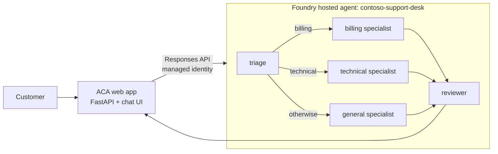
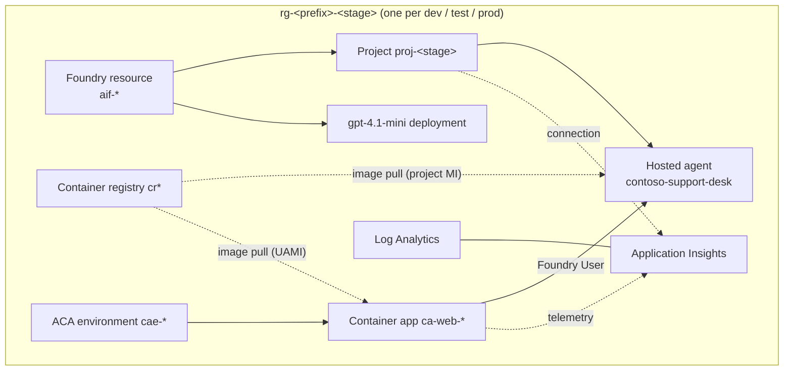

# Foundry hosted agent CI/CD sample (MAF multi-agent + Azure Container Apps)

This repository deploys a **Microsoft Agent Framework (MAF) multi-agent workflow** as a
**Microsoft Foundry hosted agent**. A **web front-end on Azure Container Apps (ACA)**
calls that agent. Each stage (`dev`, `test`, `prod`) gets its own **resource group**.
Each resource group has its own Foundry resource, Foundry project, model deployment,
container registry, Application Insights instance, and ACA app. GitHub Actions
promotes changes through the stages in order.

Authentication uses Microsoft Entra ID everywhere. The repository uses no API keys:

- Locally: `DefaultAzureCredential`.
- In CI: GitHub OIDC workload identity federation.
- Agent identity and Foundry project identity: managed identities.
- ACA app: a user-assigned managed identity.

## Use case: Contoso support desk



| Agent | Role |
|-------|------|
| `triage` | Classifies the request as `billing`, `technical`, or `general`, then summarizes the key facts. |
| `billing` / `technical` / `general` | Draft a reply. MAF switch-case routing picks one of these three agents. |
| `reviewer` | Checks the draft for tone, safety, and completeness. It returns the only output of the workflow. |

The workflow is built with `WorkflowBuilder` in [src/agent/workflow.py](src/agent/workflow.py). It is
exposed as one agent with `.as_agent()` and served on the Foundry `responses` protocol by
`ResponsesHostServer`. The prompts are in [src/agent/prompts](src/agent/prompts).

## Per-stage architecture



| Identity | Role | Scope |
|----------|------|-------|
| Deployer (developer or GitHub OIDC identity) | Foundry User, AcrPush | Foundry account, registry |
| Foundry project managed identity | Foundry User, AcrPull, Monitoring Metrics Publisher | account, registry, App Insights |
| Hosted agent instance identity (assigned at deploy time) | Foundry User | Foundry account |
| ACA web user-assigned identity | Foundry User, AcrPull, Monitoring Metrics Publisher | account, registry, App Insights |

### How a deployment works

1. **Provision.** `azd provision` runs [infra/main.bicep](infra/main.bicep), which creates the resource group and every resource in it.
2. **Publish the hosted agent.** The `predeploy` hook runs [scripts/deploy_agent.py](scripts/deploy_agent.py). The script:
   - builds `src/agent` with ACR Tasks for `linux/amd64`, using a timestamped, content-hashed tag;
   - creates a new hosted agent version;
   - grants the agent's identity Foundry User;
   - waits for the version to become `active`;
   - routes 100% of traffic to the new version.

   If the agent source hasn't changed since the active version, the script skips all of this.
3. **Deploy the web app.** azd builds `src/web` with ACA remote build and rolls out a new container app revision. When you re-provision, the app keeps the image that's already deployed.

## Repository layout

```text
src/agent/            MAF multi-agent workflow, Dockerfile, agent.yaml (hosted agent)
src/web/              FastAPI chat front-end for Azure Container Apps
infra/                Per-stage Bicep: resource group, Foundry, ACR, ACA, monitoring, RBAC
infra/bootstrap/      One-time GitHub OIDC identity
scripts/              deploy_agent.py (build/publish/invoke), predeploy hook, GitHub bootstrap
tests/                Offline tests for workflow routing, web API, and deployment logic
.github/workflows/    Staged dev -> test -> prod pipeline (reusable per-stage workflow)
```

## Prerequisites

- An Azure subscription where you can create resources and role assignments.
- Azure CLI, a recent Azure Developer CLI (`azd`), PowerShell 7, Python 3.11 or later, and, for the CI setup, GitHub CLI.
- In `swedencentral` (the default) or your chosen region, hosted-agent support and Global Standard quota for `gpt-4.1-mini` (30K TPM per stage by default).

## Deploy one stage locally

```powershell
az login
azd auth login

azd env new hosted-agents-dev
azd env set AZURE_LOCATION swedencentral
azd env set AZURE_STAGE dev
azd env set AZURE_PRINCIPAL_ID (az ad signed-in-user show --query id -o tsv)
azd env set AZURE_PRINCIPAL_TYPE User

azd up
```

To add the other stages, repeat these steps with `hosted-agents-test` / `AZURE_STAGE test` and
`hosted-agents-prod` / `AZURE_STAGE prod`. Each azd environment maps to its own resource group,
`rg-<azd env name>`. Use `azd env select <name>` to switch between stages.

When `azd up` finishes, it prints the `web` endpoint. Open it and try these prompts:

- *I was charged twice for my subscription this month. Can I get a refund?* (routes to billing)
- *Our API calls started failing with HTTP 503 an hour ago.* (routes to technical)
- *Do you have an office in Stockholm?* (routes to general)

### Invoke the hosted agent directly

```powershell
azd env get-values | ForEach-Object {
  if ($_ -match '^([^=]+)="(.*)"$') { Set-Item "env:$($Matches[1])" $Matches[2] }
}
.\.venv\Scripts\python.exe scripts\deploy_agent.py invoke --prompt "My invoice shows the wrong plan."
```

### Run locally

```powershell
python -m venv .venv; .\.venv\Scripts\pip install -r requirements-dev.txt
azd env get-values > .env        # FOUNDRY_PROJECT_ENDPOINT, AZURE_AI_MODEL_DEPLOYMENT_NAME, ...
```

In VS Code, use the launch configurations:

- **Run hosted agent locally** serves the workflow at `http://localhost:8088/responses`.
- **Run web front-end locally** starts the UI on `:8000`. The UI calls the *deployed* hosted agent.

### Force a new agent version or clean up

```powershell
.\.venv\Scripts\python.exe scripts\deploy_agent.py deploy --force   # new version even if source unchanged
azd down --purge                                                    # removes the current stage's resource group
```

## GitHub Actions setup

The pipeline in [.github/workflows/deploy.yml](.github/workflows/deploy.yml) runs these jobs in order:

1. **validate**: pytest and `bicep build`.
2. **Deploy dev**
3. **Deploy test**
4. **Deploy prod**

Each deploy job calls the reusable workflow [.github/workflows/deploy-stage.yml](.github/workflows/deploy-stage.yml)
inside its own GitHub Environment. That workflow does the following:

- runs `azd up` against the stage's own azd environment and resource group;
- smoke-tests the hosted agent through the Responses API;
- smoke-tests the ACA `/healthz` endpoint.

### One-time bootstrap

GitHub can't authenticate to Azure until your tenant trusts the repository. You grant that trust once from your machine:

```powershell
az login
gh auth login
.\scripts\bootstrap-github.ps1 -SubscriptionId '<subscription-id>'
```

The script:

- creates a user-assigned managed identity in `rg-github-identities`;
- adds federated credentials for the `dev`, `test`, and `prod` GitHub Environments;
- grants that identity Contributor and Role Based Access Control Administrator on the subscription, because each stage creates its own resource group and role assignments;
- sets these variables on every GitHub Environment:

| Variable | Value |
|----------|-------|
| `AZURE_CLIENT_ID` / `AZURE_PRINCIPAL_ID` / `AZURE_TENANT_ID` | OIDC identity |
| `AZURE_SUBSCRIPTION_ID`, `AZURE_LOCATION` | Target subscription and region |
| `AZURE_ENV_NAME` | `hosted-agents-dev`, `hosted-agents-test`, `hosted-agents-prod` → resource groups `rg-hosted-agents-<stage>` |

After you run the bootstrap, open **Actions → Provision and promote hosted agent → Run workflow**. Pushes to `main` also start the pipeline.

Recommended hardening:

- Add **required reviewers** to the `test` and `prod` GitHub Environments.
- To isolate a stage in its own subscription, override `AZURE_SUBSCRIPTION_ID` on that stage's environment and grant the identity access there.
- For production, pre-create the resource groups and scope the identity's role assignments to them instead of the whole subscription.

## Security notes

- Local authentication is disabled on the Foundry resource and on Application Insights. The registry has the admin user disabled.
- The hosted agent gets only `AZURE_AI_MODEL_DEPLOYMENT_NAME`. Foundry injects the platform variables (`FOUNDRY_*`).
- The web API validates input length and ID formats, and returns generic errors so upstream details don't leak. The UI renders agent output with `textContent`, not as HTML.
- The ACA ingress is public. Before you expose `prod` to real users, enable
  [Container Apps authentication](https://learn.microsoft.com/azure/container-apps/authentication) (Entra ID) or put the app behind a gateway, so unauthenticated callers can't run up model usage.
- Customer text is untrusted input. The triage prompt treats it as data, and the reviewer removes any request for secrets.
